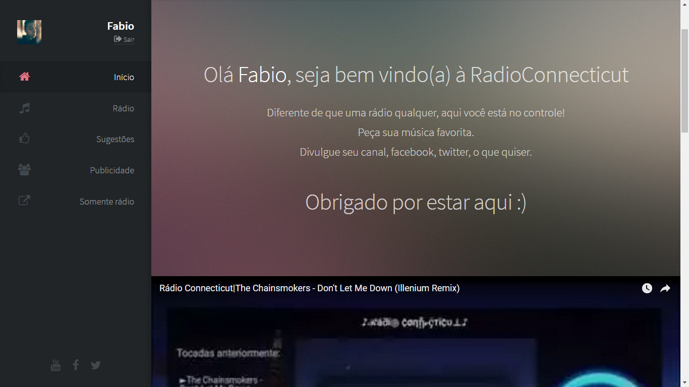
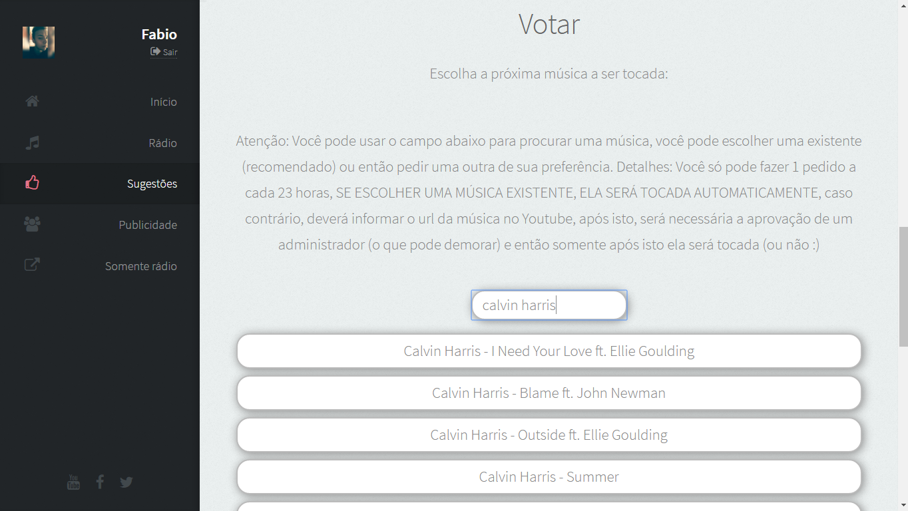
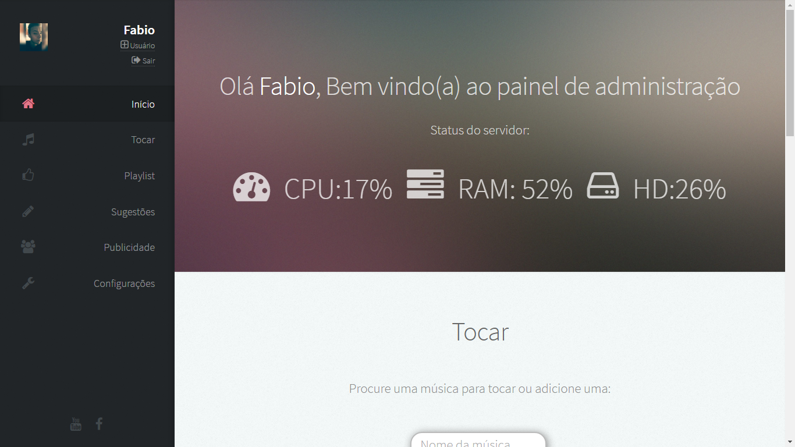
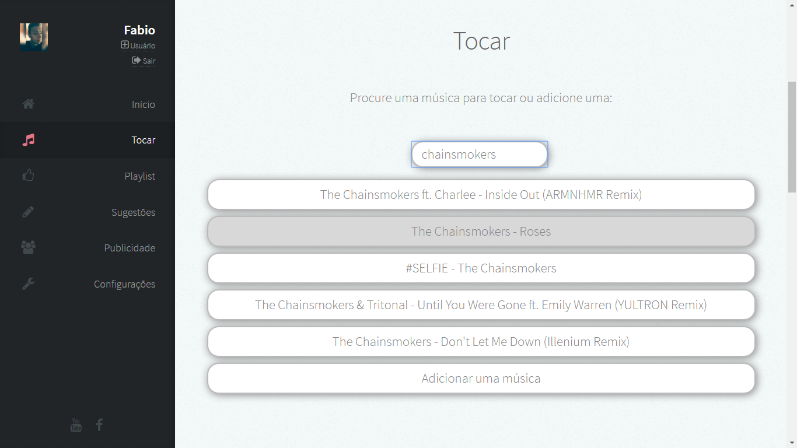
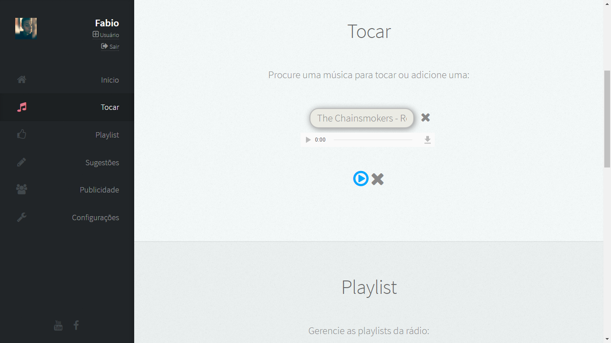
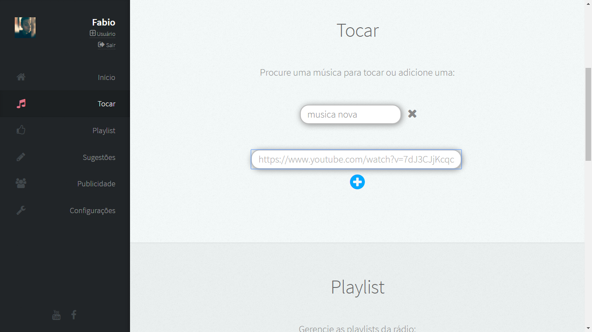
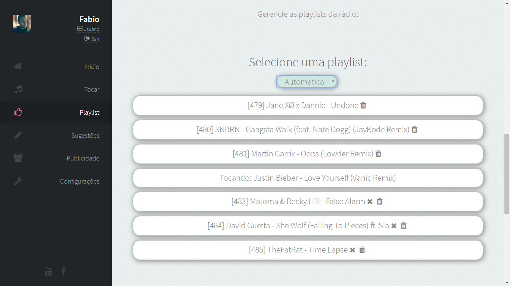
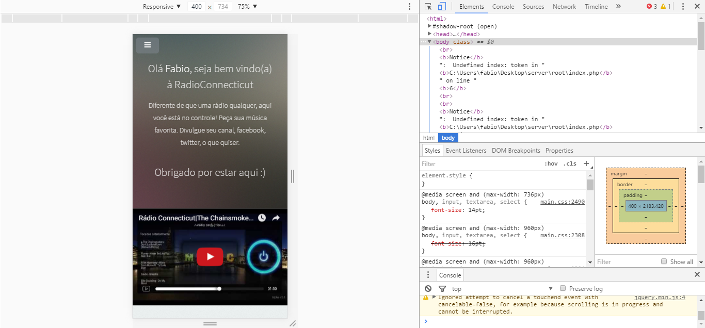

# radioconnecticut
Projeto da Rádio Connecticut

A Rádio Connecticut foi um projeto de uma webradio ao vivo no Youtube.
Infelizmente acabou não dando certo, mas enfim, funcionava da seguinte forma:

Servidor VPS->Gravava a tela do computador (o firefox aberto na página da rádio, tocando música) e fazia o streaming para o Youtube, ao vivo.
Site->Gerenciava qual música deveria tocar, permitido administradores e usuários fazerem alterações na lista de reprodução.

Havia um site, criado por mim, que tinha um player de música e alguns extras como imagens etc.
Quando a música que estava tocando acabava, o navegador fazia uma solicitação get para saber qual música deveria tocar em seguida, a resposta da solicitação era gerada automaticamente, o algoritmo para seleção de músicas funcionava desta forma: Todas as músicas existentes no banco de dados eram coletadas e jogadas em uma lista, esta lista era então embaralhada, havia um código simples onde impedia que uma música fosse tocar repetidamente.
Havia a página de usuários, possibilidade de logar com Facebook, os usuários podiam escolher uma música a ser tocada.
Na página de administração era possível escolher uma música existente no banco de dados e colocá-la como próxima a ser tocada na rádio, apagá-la, ou adicionar uma nova música, no caso de adicionar uma nova música, era necessário apenas inserir o nome da música e o endereço (url) da mesma no Youtube, que o sistema executava um script, o qual baixava a música do Youtube, convertia para mp3, adicionava a mesma ao banco de dados e colocava como próxima da playlist.
Eu ainda tinha desenvolvido um pequeno sistema de anúncios, a forma da qual eram reproduzidos os anúncios era através de arquivos mp3, contendo mensagens de áudio ou o que seria anunciado, os anúncios eram configurados para serem reproduzidos ao intervalo de 5 músicas, a cada 5 músicas tocadas, um anúncio era reproduzido. Cada anúncio tinha um número de reproduções, por exemplo, se um anúncio tivesse 50 como número de reproduções, ele seria reproduzido até 50 vezes, após isso, se tornaria inativo. Outra função eram as prioridades de anúncios, cada anúncio, deveria possuir um valor de importância, de que deveria ser reproduzido com mais frequência do que os outros, em uma escala de 0 a 10, por exemplo, se existissem dois anúncios, o anúncio "A" com o valor 5 e o anúncio "B" com o valor 10, o anúncio "B" seria reproduzido com o dobro de frequência do que o "A".
Levei cerca de dois meses para desenvolver todo o código, poderia ter feito muito melhor, tenho certeza disso, fiz esse projeto aos meus 17 anos, existem muitos recursos a mais do que descrevi aqui na rádio, porém alguns como o programa que gravava a tela e fazia streaming foram perdidos, e muitos outros estão incluídos no código da rádio, sinta-se a vontade para ver/editar/utilizar o código, não fiz como algo profissional, apenas programando em meu tempo livre e com o principal objetivo de aumentar meu conhecimento, minha habilidade lógica e de programação.

*Obs: O sistema estaria apenas em uma fase inicial, onde grande parte do código se encontra não muito bem otimizado e possuindo graves problemas de segurança (SQL Injection é um deles).

Dúvidas? Entre em contato: fabiolux999@gmail.com
